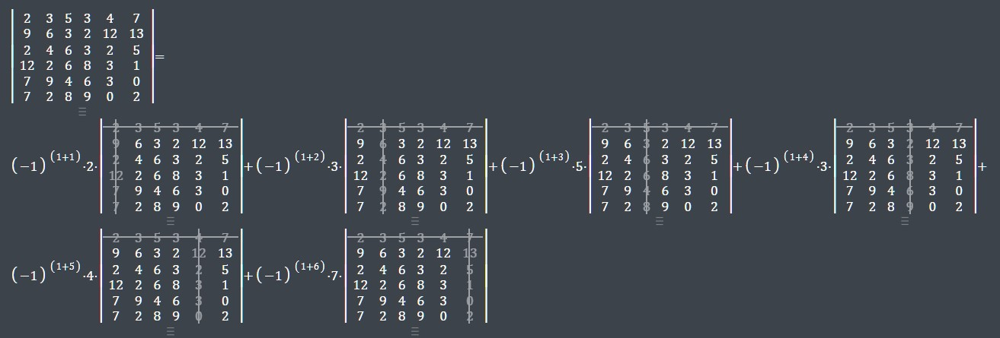

# Клиент-серверное приложение Matrix Determinants

1. [Функциональность](#functionality)
2. [Особенности алгоритма](#speciality)
	- Вычисление определителя
	- Заполнение матрицы случайными числами double
3. [Сборка программы и требования](#requirements)

<a id="functionality"></a>
## Функционал
Клиент-серверное приложение на языке C для ОС Linux со следующим функционалом:

**Клиент**  
По нажатию кнопки или по таймеру высылает на сервер матрицу размером 6x6 со случайными значениями типа double.

**Сервер**  
При получении матрицы от клиента вычисляет и выводит в консоль следующие значения:
- Определитель принятой матрицы
- Среднее арифметическое значение определителя среди последних 5 полученных матриц (если принято менее 5 матриц - выводит "N/A")
- Определитель матрицы, полученной 5 матриц назад (если принято менее 5 матриц, выводит "N/A")

**Пример работы:**  
С клиента последовательно высылаются матрицы с определителями 0, 1, 2, 3, 4, 5.  
Вывод сервера при получении последнего значения:  
	Det. = 5.0  
	Avg. det = 3.0  
	Del. det = 1.0  

<a id="speciality"></a>
## Особенности алгоритма

### Вычисление определителя
Вычисление определителя происходит методом разложения по строке, также известным, как разложение по Минорам или разложение по Лапласу. Метод обеспечивает асимпотическую сложность O(n!).



Существуют другие алгоритмы, имеющую меньшую асимптотическую сложность. Например, оценка сложности показана в источнике:
https://informatika.stei.itb.ac.id/~rinaldi.munir/Matdis/2016-2017/Makalah2016/Makalah-Matdis-2016-051.pdf
, где приведены алгоритмы со сложностью O(n^3).  
При размерах матрицы 5х5 (n = 5) алгоритм раложения по Лапласу имеет преимущество. При больших n предпочтительнее другие алгоритмы.  

В ходе расчёта для удобства, алгоритмом используется построение вспомогательных суб-матриц из основной матрицы. С учетом рекурсивности алгоритма и тем, что суб-матрицы многократно повторяют содержимое исходной матрицы, существует резерв для увеличения эффективности по затрачиваемой памяти, если разработать алгоритм взятия значений субматрицы без построения вспомогательной.

### Заполнение матрицы случайными числами double
При вычислении определителя матрицы возможно переполнение переменной с результатом вычислений.  
Т.к. результат помещается в переменную типа double, максимальное значение, которре возможно сохранить:  
[-1.797693e+308 ... +1.797693e+308]  
При вычсилении определителя в него входит n! слагаемых. Где каждое слагаемое является произведением n множителей.

**Приблизительное определение ограничения на значение элемента матрицы**  

Таким образом, для исключения переполнения результата в наихудшем случае, необходимо ограничить максимальное значение элемента матрицы.
Результатом сложения 6! (=720) слагаемых, каждое из которых соделжит произведение 6 множителей, должно быть число по модулю не более +1.797693e+308.  

Т.е. максимальное число в ячейке = корень 6 степени из (+1.797693e+308) / 720  
= 3.402824e+38 / 720 = 4.726144e+35

Таким образом, генератор случайных чисел следует ограничить диапазоном [-4.726144e+35 ... 4.726144e+35].

**Проблема малых чисел**  
Для ограничения диапазона можно генерировать числа в диапазоне [-DBL_MAX ... DBL_MAX] и масштабировать до указанного диапазона.
С учетом равномерного распределения возникнет множество случаев со значениями с высокими отрицательными степенями (близкие у нулю значения),
что, в большинстве случаев, будет приводить к значениям определителя около 0.

Поэтому удобно воспользоваться генерированием чисел в размерности float, которые имеют очень близкие предельные значения:
FLT_MAX = 3.402823e+38. А затем ограничивать до диапазона FLT_MAX / 720. Это обеспечит наглядные результаты вычислений без переполнений.

<a id="requirements"></a>
## Сборка программы и требования
Программа реализована для системы Linux.  
Компиляция и сборка программы осуществляется с помощью CMake и компилятора C.  

Программа проверялась при конфигурации:  
ОС: Ubuntu 22.04.3 LTS (в среде WSL)  
Компилятор: GCC 11.4.0 x86_64-linux-gnu  
CMake: cmake version 3.22.1

**Порядок сборки**
1. Клонировать репозиторий или скачать исходные файлы
2. Войти в папку с исходными файлами и создать папку сборки:

```
mkdir build
```

3. Перейти в папку сборки и инициализировать cmake:

```
cd build
cmake ..
```

4. Запустить сборку:

```
cmake --build .
```

Будут созданы 2 исполняемых файла: **client** и **server**

**Запуск сервера**  

```
./server
```

Параметры: _нет._   
Порт сервера конфигурируется в исходном файле **server.c**   
Выход из программы: _Ctrl+C_    

**Запуск клиента**  
Производить после запуска сервера. При остутствии связи с сервером программа останавливается.  

```
./client
```

Параметры: _нет._  
Адрес передачи информации и порт конфигурируются в исходном файле **client.c**  
Отправка пакетов происходит с интервалом 1 секунда (настраивается к константах исходного файла) или по нажатию любой клавиши пользователем.   
Первый пакет содержит тестовую матрицу с посчитанным заранее определителем ( = 11456).  
Выход из программы: _Ctrl+C_